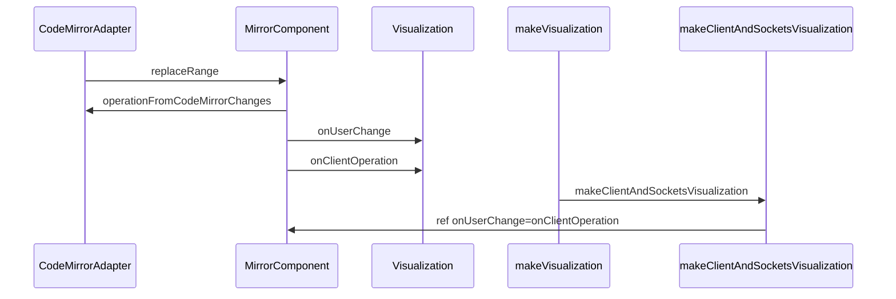
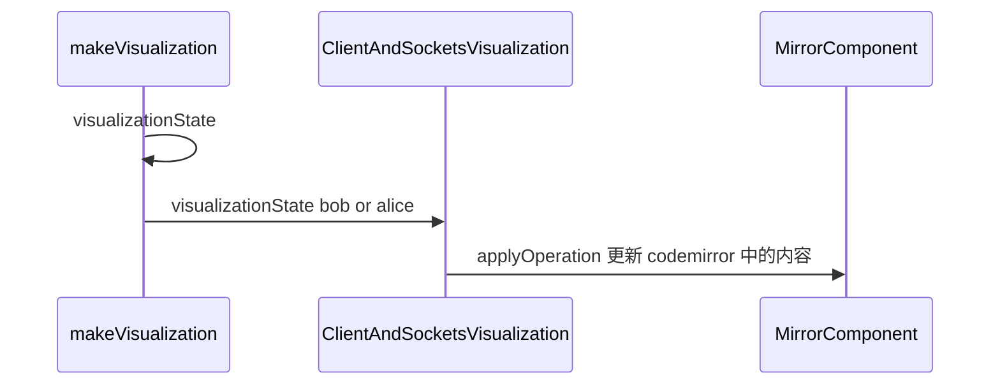
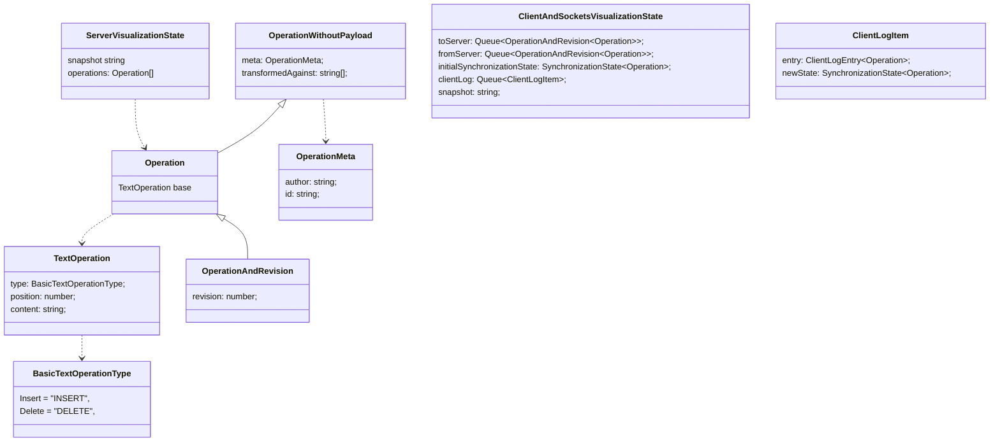

```mermaid
sequenceDiagram
CodeMirrorAdapter ->> MirrorComponent: replaceRange
MirrorComponent ->> CodeMirrorAdapter: operationFromCodeMirrorChanges
MirrorComponent ->> Visualization: onUserChange
MirrorComponent ->> Visualization: onClientOperation
%%  这里传入 state，onClientOperation onServerReceiveClick onClientReceiveClick
makeVisualization ->> makeClientAndSocketsVisualization: makeClientAndSocketsVisualization
makeClientAndSocketsVisualization ->> MirrorComponent: ref onUserChange=onClientOperation
```

```mermaid
sequenceDiagram
%% VisualizationState 包含 alice bob server
makeVisualization ->> makeVisualization: visualizationState
makeVisualization ->> ClientAndSocketsVisualization: visualizationState bob or alice
ClientAndSocketsVisualization ->> MirrorComponent: applyOperation 更新 codemirror 中的内容
```

class 语法规则：https://mermaid.js.org/syntax/classDiagram.html#configuration

```mermaid
classDiagram
  OperationWithoutPayload <|-- Operation
  ServerVisualizationState ..> Operation
  TextOperation ..>	 BasicTextOperationType
  OperationWithoutPayload ..> OperationMeta
  Operation ..> TextOperation
  Operation <|-- OperationAndRevision 
  class BasicTextOperationType {
    Insert = "INSERT",
    Delete = "DELETE",
  }
  class TextOperation {
    type: BasicTextOperationType;
    position: number;
    content: string;
  }

  class ServerVisualizationState {
    snapshot string
    operations: Operation[] 
  }

  class Operation {
    TextOperation base
  }
  class OperationAndRevision {
  revision: number;
}

  class OperationWithoutPayload {
    meta: OperationMeta;
    transformedAgainst: string[];
  }

  class OperationMeta {
    author: string;
    id: string;
  }

  class ClientAndSocketsVisualizationState {
    toServer: Queue~OperationAndRevision~Operation~~;
    fromServer: Queue~OperationAndRevision~Operation~~;
    initialSynchronizationState: SynchronizationState~Operation~;
    clientLog: Queue~ClientLogItem~;
    snapshot: string;
  }

  class ClientLogItem {
    %% ClientLogEntry 记录了 changeset 往来 server 的各种情况
    %% 1. USER_EDIT_IMMEDIATELY_SENT_TO_SERVER 首次编辑
    %% 2. USER_EDIT_STORED_AS_BUFFER 追加变更
    %% 3. USER_EDIT_ADDED_TO_BUFFER 再次追加变更
    %% 4. RECEIVED_OWN_OPERATION_AND_SENT_BUFFER server ack 发送 buffer
    %% 5. RECEIVED_SERVER_OPERATION_WHILE_SYNCHRONIZED 从 server 同步
    %% 6. RECEIVED_SERVER_OPERATION_WHILE_AWAITING_OPERATION 首次编辑的时候从 server 同步
    %% 7. RECEIVED_SERVER_OPERATION_WHILE_AWAITING_OPERATION_WITH_BUFFER 追加变更, 从 server 同步
    entry: ClientLogEntry~Operation~;
    %% 1. SYNCHRONIZED 同步状态
    %% 2. AWAITING_OPERATION 首次编辑待同步
    %% 3. AWAITING_OPERATION_WITH_BUFFER 追加的编辑待同步
    newState: SynchronizationState~Operation~;
  }


```
