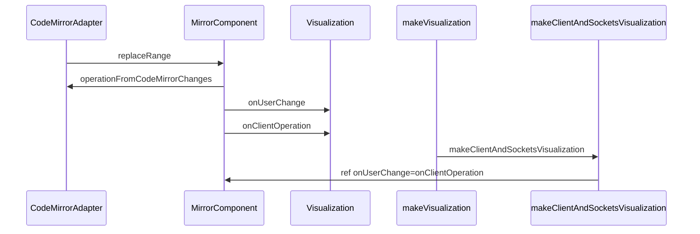
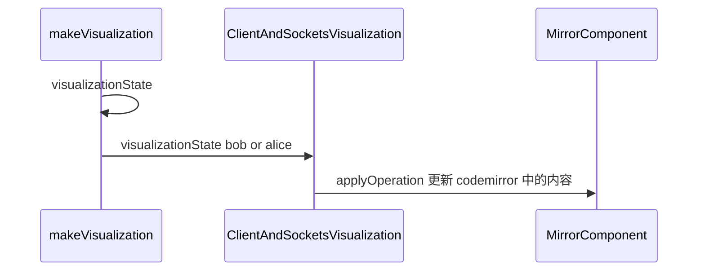

```mermaid
sequenceDiagram
CodeMirrorAdapter ->> MirrorComponent: replaceRange
MirrorComponent ->> CodeMirrorAdapter: operationFromCodeMirrorChanges
MirrorComponent ->> Visualization: onUserChange
MirrorComponent ->> Visualization: onClientOperation
%%  这里传入 state，onClientOperation onServerReceiveClick onClientReceiveClick
makeVisualization ->> makeClientAndSocketsVisualization: makeClientAndSocketsVisualization
makeClientAndSocketsVisualization ->> MirrorComponent: ref onUserChange=onClientOperation
```

```mermaid
sequenceDiagram
%% VisualizationState 包含 alice bob server
makeVisualization ->> makeVisualization: visualizationState
makeVisualization ->> ClientAndSocketsVisualization: visualizationState bob or alice
ClientAndSocketsVisualization ->> MirrorComponent: applyOperation 更新 codemirror 中的内容
```
